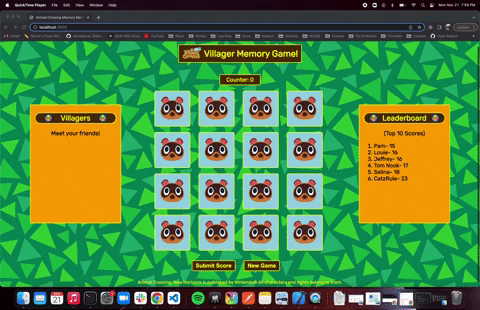
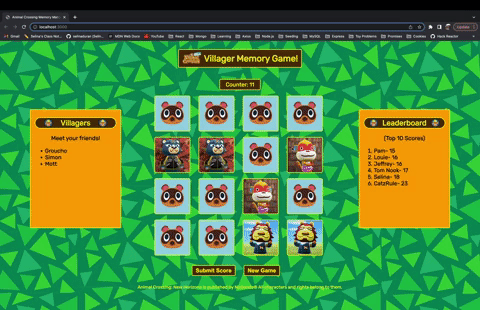
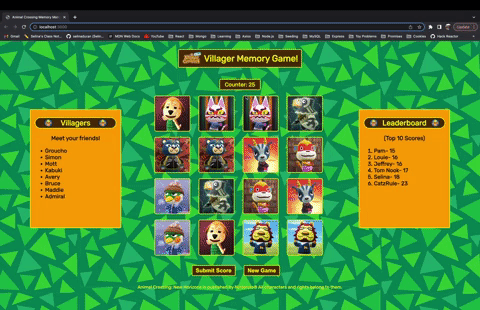

# MVP-Project: Animal Crossing Memory Match!

This is a MVP (Minimum Viable Product) Project that I completed as a student at Hack Reactor. We had a total of 24 hours to create a full-stack application of our choosing.

With the emphasis on full-stack, this application includes the following:
1. Frontend: [React](https://reactjs.org/)
2. Server: [Express.js](https://expressjs.com/)
- Will help with getting villager cards from outside API.
- Will also help with obtaining top 10 scores from PostgreSQL database.
3. Database: Outside API & [PostgreSQL](https://www.postgresql.org/)
- ACNH API: This is actually a free external API (http://acnhapi.com/) that will be utilized to provide images of the Animal Crossing villagers and used for making cards.
- PostgreSQL: Relational database will be used for storing scores users submit upon completing a game round (Will provide top 10 scores).

## Walkthrough

Users will be given a shuffled memory-match board that consists of ACNH villager cards. Each user will be able to match cards while a counter keeps track of number of attempts.

As each villager is matched, users will have the ability to see the villager's character profile to learn more about the villager's personality and characteristics.

Once a round is completed, users will be able to submit their score to see if it makes it to the high score board.

## Getting Started
1. Use npm to install the required dependencies.
```
npm install
```
2. Run the application using:
```
npm run dev
npm run server
```
